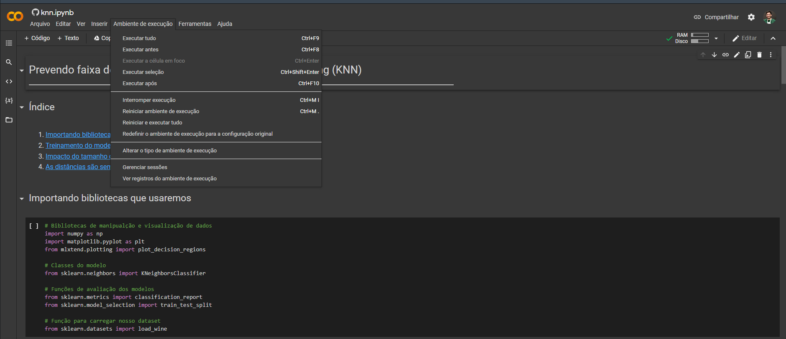
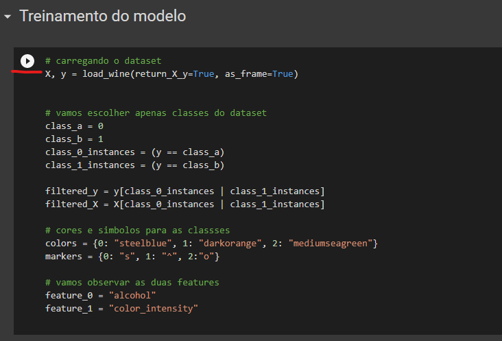

# Monitoria Machine Learning

## Utilizando Google Colab

Usar o Google Colab é a forma mais simples de executar os códigos em python.

1. Primeiro, entre em https://colab.research.google.com . Após o login, será mostrada a tela abaixo com os notebooks mais recentes que você abriu.

2. Clique na aba GitHub e insira o link do repositório https://github.com/walbermr/monitoria-ml . Após isso, todos os notebooks no repositório ficarão visíveis, e você poderá abri-los em uma nova guia.

3. Finalmente, com o notebook aberto, você poderá programar e executa-lo como quiser. Para garantir que todas as variáveis estarão configuradas, clique na aba _Ambiente de execução_ e clique em _Executar tudo_.

    Um notebook é composto por duas células base, uma célula _markdown_ e uma célula de código.

    As células _markdown_ são células que contém texto. Além de texto, equações no formato LaTeX também podem ser inseridas.

    Já nas células de código, você pode executar os trechos de código em python de forma isolada.

    
4. Para executar uma célula de código, mantenha o mouse em cima da célula e clique no botão que aparecer no canto superior esquerdo da célula, ou clique na célula e aperte _ctrl+enter_. Se houver algum resultado para ser mostrado na tela, ele será mostrado abaixo.

